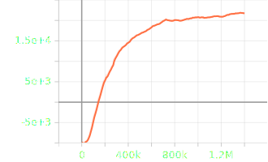

<br>
<br>


[](https://github.com/BennerLukas/on-time/issues)
[](https://github.com/BennerLukas/on-time/blob/main/LICENSE)
[](https://github.com/BennerLukas/on-time/network)
[](https://github.com/BennerLukas/on-time/stargazers)


## Usage
To install all packages both the requirements and the local environment must be installed
```bash
pip install -r requirements.txt
pip install -e gridworld-mannheim-gym
```

To start training on our custom environment execute the following command
```bash
python run.py
```
For than viewing the results start the tensorboard and see the visualisations in your browser.
```bash
tensorboard --logdir logs
```


## Idea & Approach
We want to deliver a service for railway and transport companies worldwide to decrease delays and increase the punctuality of trains. 
This increases customer satisfaction and thereby the usage. This has a big benefit for our world, fighting against climate change and traffic jams.

## Technology
We use OpenAI Gym vor our own custom simulation. For developing the agent we use the new ray library. 
It has a RLlib submodule where you can train different environments with different reinforcement learning algorithms.

Here you can see the train map with all stops, lights and switches. 
This what the agent is seeing (mathematically) to decide which signal to activate.
```python
                                      ||||                                      
                                      S0||                                      
                                      W/||                                      
      //----SP----SP------SP----------||W/S0--------SP------------              
    ||  ----SP----SP------SP------S0W/||||----------SP----------\\\\            
    ||//                              ||W/                        \\\\          
    ||||                              ||S0                          S0\\        
    ||||                              ||||                          W\W/W\S0----
    ||||                              ||||                          ||||--------
    S0||                              S0||                          W/W/        
----W\--W\S0--SP------SP--------------W\||W\S0--SP------------SP----||S0        
--S0----------SP------SP------------S0||||------SP------------SPS0W\W/W\        
                                      ||S0                          S0S0        
                                      ||||                          W\W/W\S0SP--
                                      ||||                          ||||----SP--
                                      ||||                          ||W/        
                                      ||||                          ||S0        
                                      ||||                          ||||        
                                      ||||                          //||        
                                      \\  \\----W/S0--SP----------SP  ||        
                                        --S0W\--W\----SP----------SP//          
                                              ||W/                              
                                              SPS0                              
                                              ||||                              
```
The experiment to run the agent will be done in the run.py. It executes a DQN which learns the best policy.

For performance increases are we using a GPU. With the help of CUDA and the underlying Tensorflow can the DQN model be trained faster.

## Team
- [Ayman Madhour](https://github.com/Madhour)
- [Lukas Benner](https://github.com/BennerLukas)
- [Alina Buss](https://github.com/Alinabuss)
- [Phillip Lange](https://github.com/Sabokou)
- [Paula Hölterhoff](https://github.com/phoelti)

## Business
for more see ```docs```. There you can find the BusinessModelCanvas, ValuePropositionCanvas and the PitchDeck.

## Documentation & further resources
For information about our Learnings in this project see ```LEARNINGS.md```
The environment was tested with a PPO algorithm that was trained for 300 episodes. The reinforcement learning agent showed great improvement during 
training as can be seen in the included SVG-graphs (```docs/code``` folder), which were exported from tensorboard. Furthermore,
the latest checkpoint of the PPO agent can be found in the ```logs/PPO``` folder.


<p align="center">Mean reward at each step</p>
<br>
The underlying theory can be found indepth in the presentation.